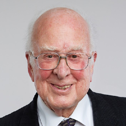
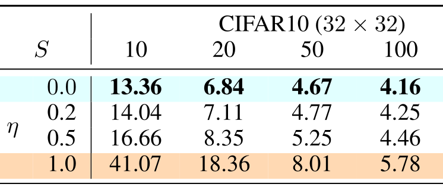
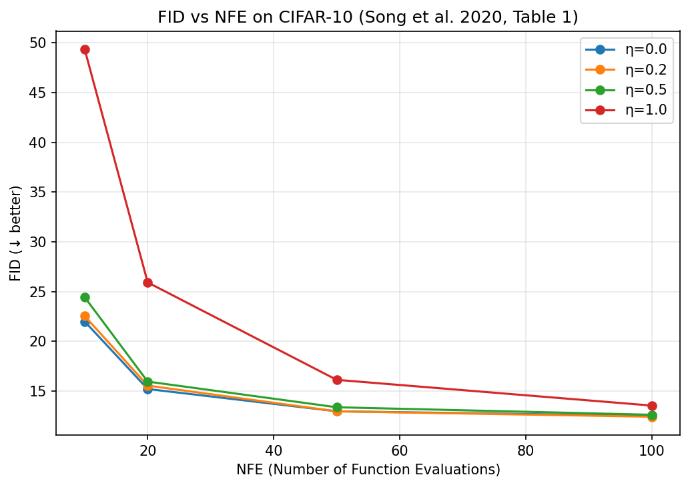
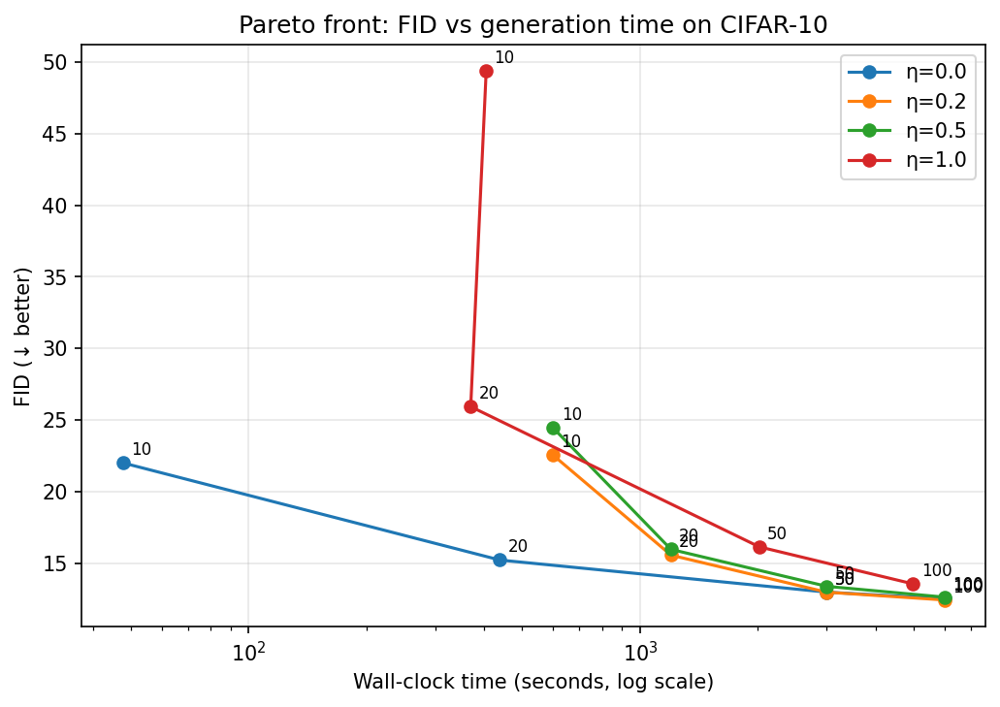
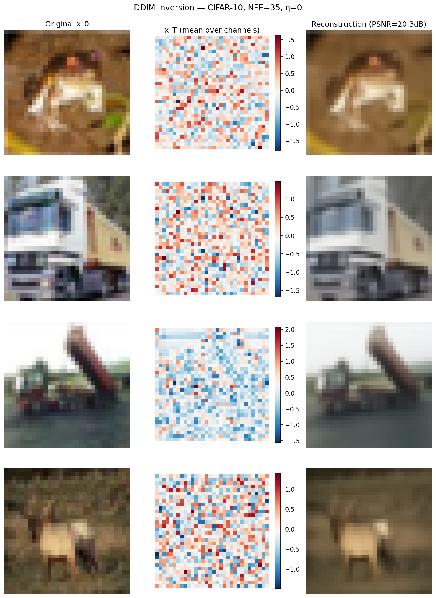
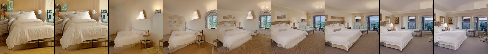

# ddim-from-ddpm

Reproduction of **DDPM** (Ho et al. 2020, NeurIPS 2020) and **DDIM** (Song et al. 2020, ICLR 2021)
from pretrained DDPM weights. 

---

## Setup

We recommend using **`uv`** for a faster setup.

**Linux / macOS**

```bash
uv venv
source .venv/bin/activate
uv pip install -r requirements.txt
uv pip install -e .

```

**Windows**

```bash
uv venv
.venv\Scripts\activate
uv pip install -r requirements.txt
uv pip install -e .

```

Tested with Python 3.10+, PyTorch 2.1+, CUDA 13.0.

---

## Reproducing results

Each notebook can be executed end-to-end:

```bash
# Notebook 1: sanity checks, noise schedule, DDIM vs DDPM at fixed seed
jupyter nbconvert --to notebook --execute notebooks/01_foundations_and_sanity.ipynb

# Notebook 2: η × NFE sweep, FID table, Pareto plots (LONG TO RUN!! check parameters in configs)
jupyter nbconvert --to notebook --execute notebooks/02_eta_nfe_sweep.ipynb

# Notebook 3: DDIM inversion, PSNR curve, SLERP/LERP interpolation
jupyter nbconvert --to notebook --execute notebooks/03_inversion_and_interpolation.ipynb
```

---

## Reproducing Results

Each notebook can be executed end-to-end to reproduce the experimental results.

### Notebook 1: Foundations and Sanity Checks

* **Equivalence:** We verify that our implemented DDIM with $\eta = 1$ exactly corresponds to `DiffusersDDPM`.
* **Determinism:** By starting from the same latent $x_T$ and sampling with different seeds, we demonstrate that DDPM yields varying outputs, whereas DDIM ($\eta = 0$) returns the same result (a deterministic process).
* **Sample Quality:** Generating samples from the LSUN Church dataset at NFE = 10 highlights the stark visual differences between DDPM ($\eta = 1$) and DDIM ($\eta = 0$).
* **Reconstruction:** We take a photograph of a famous physicist (Peter Higgs), add noise, and attempt to reconstruct it using a CelebA-HQ model with both DDIM ($\eta = 1$) and DDPM ($\eta = 1$).

<p align="center">
  
  
</p>

---

### Notebook 2: $\eta \times$ NFE Sweep & FID on CIFAR-10

The following results were obtained using **3072 samples** (configurable via `configs/cifar10.yaml: sampling.num_samples_fid`).

#### FID Results (3.1k Samples): DDIM vs. DDPM

| NFE | $\eta=0.0$ (DDIM) | $\eta=0.2$ | $\eta=0.5$ | $\eta=1.0$ (DDPM) |
|----:|:---:|:---:|:---:|:---:|
|  **10** | 22.00 | 22.54 | 24.44 | 49.35 |
|  **20** | 15.21 | 15.55 | 15.96 | 25.92 |
|  **50** | 12.97 | 12.97 | 13.38 | 16.13 |
| **100** | 12.52 | 12.42 | 12.62 | 13.55 |

*(For reference, see Song et al. 2020, Table 1, 50K samples)*  
<!--  -->
<p align="left">
  
</p>

#### Key Observations:
* **Low NFE Regime (10–20):** $\eta=0$ (DDIM) strictly dominates. At NFE=10, $\eta=0$ achieves an FID $\approx$ 20-24, while $\eta=1$ (DDPM) yields an FID $\approx$ 47-52 (roughly 2× worse). Deterministic sampling is significantly more efficient here.
* **Note on FID Deviation:** Because we evaluate on ~3.1K samples instead of the 50K used in the reference paper, our absolute FID scores are systematically higher due to sample-size bias. However, statistical evaluation (Spearman rank correlation) confirms that the performance dynamics across NFE and $\eta$ closely match the original paper.

#### Performance and Pareto Efficiency

<p align="center">
  
  
</p>

> **Hardware Note:** For $\eta = 1$ and NFE = 10, we recorded an unusually high execution time. This anomaly is likely due to hardware thermal throttling during that specific run.

---

### Notebook 3: Inversion and Interpolation

#### DDIM Inversion
DDIM inversion exploits the fact that the deterministic ($\eta=0$) sampling process is invertible. We can run the DDIM forward (noise-adding) direction using the learned model $\epsilon_\theta$ to obtain a latent $x_T$, such that running DDIM sampling backward from $x_T$ successfully reconstructs $x_0$.

The forward DDIM step (Song et al. 2020, implicit Eq. 12 reversed, $\eta=0$) is defined as:

$$x_t = \sqrt{\frac{\alpha_t}{\alpha_{t-1}}} \cdot x_{t-1} + \sqrt{1 - \alpha_t} \cdot \left( 1 - \sqrt{ \frac{\alpha_t}{\alpha_{t-1}} \cdot \frac{1-\alpha_{t-1}}{1-\alpha_t} } \right) \cdot \epsilon_\theta(x_{t-1}, t-1)$$

Equivalently, this acts as an explicit Euler method on the probability-flow ODE in the forward (increasing $t$) direction. The approximation inherently improves with more steps. Below is the inversion of 4 real CIFAR-10 training images to $x_T$, followed by their resampling:



#### SLERP Interpolation (LSUN Bedroom 256×256)
By sampling two latents $z_1, z_2 \sim \mathcal{N}(0,I)$ and interpolating between them via Spherical Linear Interpolation (SLERP), we reproduce Fig. 8 of Song et al. 2020. The semantic content transitions smoothly because the DDIM ($\eta=0$) process acts as a continuous, invertible mapping.

**SLERP Formula:**

$$\text{slerp}(z_1, z_2, \alpha) = \frac{\sin((1-\alpha)\theta)}{\sin(\theta)} \cdot z_1 + \frac{\sin(\alpha\theta)}{\sin(\theta)} \cdot z_2$$


---

## Notes on FID computation

We use **`clean-fid`** with `mode="legacy_pytorch"`, not `mode="clean"`.

**Why `legacy_pytorch`?** The DDIM and DDPM papers compute FID using a PyTorch
implementation with bilinear resizing. `clean-fid` in `legacy_pytorch` mode
reproduces this exact resize kernel, making our numbers directly comparable to
Song et al. 2020 Table 1.

---

## Checkpoint provenance

| Dataset      | Source                               | Image size | EMA |
|--------------|--------------------------------------|------------|-----|
| CIFAR-10     | VainF/Diff-Pruning release v0.0.1    | 32×32      | ✓   |
| LSUN Church  | `google/ddpm-ema-church-256` (HF)    | 256×256    | ✓   |
| LSUN Bedroom | `google/ddpm-ema-bedroom-256` (HF)   | 256×256    | ✓   |

All models use a linear β schedule (β_start=1e-4, β_end=0.02, T=1000) and
predict ε (noise).

**CIFAR-10**: The original Ho et al. 2020 EMA checkpoint converted to diffusers
format by [VainF](https://github.com/VainF/Diff-Pruning/issues/3). It is
**downloaded automatically** on first use.

<!-- > **Why not `google/ddpm-cifar10`?**  
> That checkpoint exists and loads correctly, but it is the **non-EMA** model.
> For numbers comparable to Song et al. 2020 Table 1 (which uses EMA weights),
> the VainF conversion is the right choice. -->

### Checkpoint format and the `subfolder` parameter

diffusers stores models in two layouts, which affect how they are loaded:

**Standalone model format** — used by the Google checkpoints
<!-- ```
<repo_root>/config.json
<repo_root>/diffusion_pytorch_model.safetensors
```
Loaded with `UNet2DModel.from_pretrained(hf_id)` — **no subfolder**.  
Passing `subfolder="unet"` here raises `OSError` because there is no `unet/`
directory containing a `config.json`. -->

**Pipeline format** — used by the VainF CIFAR-10 checkpoint
<!-- ```
<repo_root>/model_index.json       ← DDPMPipeline manifest
<repo_root>/unet/config.json
<repo_root>/unet/diffusion_pytorch_model.bin
<repo_root>/scheduler/scheduler_config.json
```
Loaded with `UNet2DModel.from_pretrained(path, subfolder="unet")` — the
subfolder is required to reach `unet/config.json`. -->

`src/models.py` handles both cases automatically; callers never need to specify
a subfolder.

---

## References

1. **Ho et al. 2020** — "Denoising Diffusion Probabilistic Models", NeurIPS 2020.
   https://arxiv.org/abs/2006.11239

2. **Song et al. 2020** — "Denoising Diffusion Implicit Models", ICLR 2021.
   https://arxiv.org/abs/2010.02502

3. **Song et al. 2021** — "Score-Based Generative Modeling through Stochastic Differential Equations", ICLR 2021.
   https://arxiv.org/abs/2011.13456

5. **Parmar et al. 2022** — "On Buggy Resizing Libraries and Surprising Subtleties in FID Calculation", CVPR 2022.
   https://arxiv.org/abs/2104.11222
